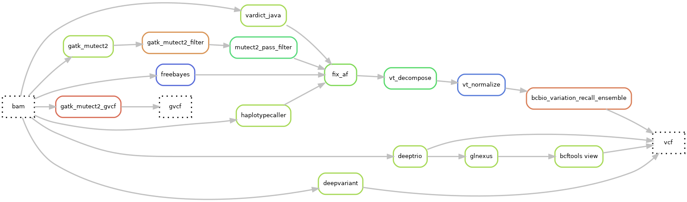

# Hydra-genetics cnv_indel module
The snv_indel module consists of a number of small variant callers for short read data of both somatic and germline samples. There is also tools for variant decomposition, (vt) normalization (vt), ensemble (bcbio) and sorting (bcftools). 

## Callers

| Caller | Type | Comment |
|-|-|-|
| [freebayes](https://github.com/freebayes/freebayes) | somatic |
| [mutect2](https://gatk.broadinstitute.org/hc/en-us/articles/13832710384155-Mutect2) |  |
| [vardict](https://github.com/AstraZeneca-NGS/VarDict) | _ _ |
| [haplotypecaller](https://gatk.broadinstitute.org/hc/en-us/articles/13832687299739-HaplotypeCaller) | germline |
| [deepvariant](https://github.com/google/deepvariant) |  |
| [deeptrio](https://github.com/google/deepvariant) |  | trio |
| [glnexus](https://github.com/dnanexus-rnd/GLnexus) | _ _ | trio / joint calling |

## Dag graph

## Module input files
Aligned, duplicate marked, sorted, and indexed `.bam`-files. The `.bam`-files are either split into chromosomes or merged.

* `alignment/picard_mark_duplicates/{sample}_{type}_{chr}.bam`
* `alignment/samtools_merge_bam/{sample}_{type}.bam`

## Module output files
Small variants in the `.vcf`-format for respective caller or one ensembled, decomposed, and normalized `.vcf`-file.

* `snv_indels/bcbio_variation_recall_ensemble/{sample}_{type}.ensembled.vcf.gz`
* `snv_indels/deeptrio/{sample}_{type}/{trio_member}.merged.sorted.vcf.gz`
* `snv_indels/deepvariant/{sample}_{type}.merged.sorted.vcf.gz`
* `snv_indels/freebayes/{sample}_{type}.merged.sorted.vcf.gz`
* `snv_indels/gatk_mutect2/{sample}_{type}.merged.sorted.vcf.gz`
* `snv_indels/glnexus/{sample}_{type}.bcf`
* `snv_indels/haplotypecaller/{sample}_{type}.merged.sorted.vcf.gz`
* `snv_indels/vardict/{sample}_{type}.merged.sorted.vcf.gz`
