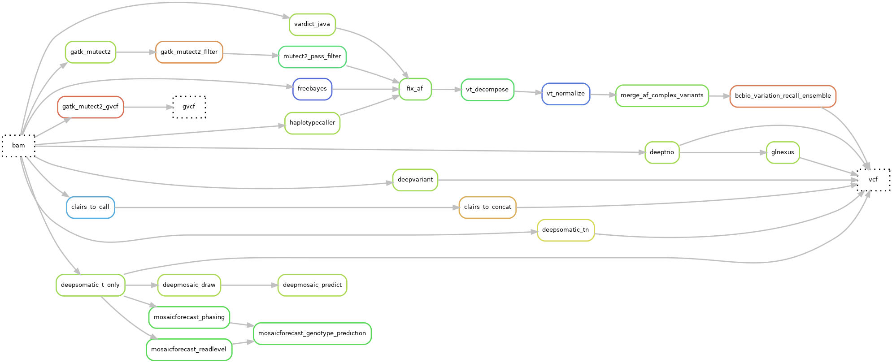
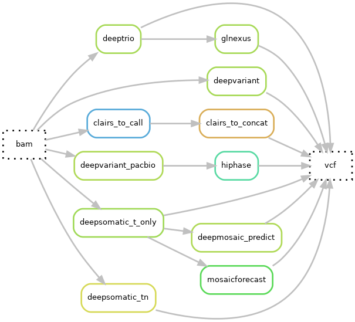

# Hydra-genetics snv_indels module

The **snv_indels** module consists of a number of variant callers for:  
* Short-read (SR) data, both somatic and germline small variants, that is SNV and indels.  
* Long-read (LR) data, both somatic and germline variants, that is SNV and indels. Most of the variant callers for LR data are based on deep-learning models that were trained on WGS data at low coverage.
  
Some tools are able to handle data from tumor-only (TO) samples, while others require matched normal (MN) samples.
 
 

Somatic calls can be made by:
- freebayes, mutect2, vardict, deepsomatic, clairs-to.

Germline calls can be produced by:
- haplotypecaller, deepvariant, deeptrio, glnexus.
 
The module also provide tools for:

* variant decomposition and normalization with _VT_ (applicable to both SR and LR data),

* aggregation of the results from different callers into an ensemble with *bc_bio* (only for SR data),

* sorting and indexing of the variants with _bcftools_ (applicable to both SR and LR data),

* predict which somatic variants are likely to be mosaicisms with _deepmosaic_ or _mosaicforecast_ (applicable to both SR and LR data).
 

The module is designed to be used in a snakemake pipeline and can be easily integrated into existing pipelines that
follow the logic of [**hydra-genetics**](https://hydra-genetics.readthedocs.io/en/latest/).
 
 
 
 

    

## Callers

| Caller | Type     | Comment                                                                  |
|-|----------|--------------------------------------------------------------------------|
| [freebayes](https://github.com/freebayes/freebayes) | somatic  |                                                                          | 
| [mutect2](https://gatk.broadinstitute.org/hc/en-us/articles/13832710384155-Mutect2) | somatic  |                                                                          | 
| [vardict-java](https://github.com/AstraZeneca-NGS/VarDictJava) | somatic  | Java version used due to speed                                           | 
| [haplotypecaller](https://gatk.broadinstitute.org/hc/en-us/articles/13832687299739-HaplotypeCaller) | germline |                                                                          |
| [deepvariant](https://github.com/google/deepvariant) | germline |                                                                          | 
| [deeptrio](https://github.com/google/deepvariant) | germline | trio                                                                     |
| [glnexus](https://github.com/dnanexus-rnd/GLnexus) | germline | trio / joint calling                                                     |
| [deepsomatic]() | somatic  | deep-learning based caller for somatic variants derived from deepvariant |
| [deepmosaic]() | somatic  | predict mosaicisms in TO samples based on the output of deepsomatic or Mutect2|
| [mosaicforecast]() | somatic  | predict mosaicisms in TO samples  based on the output of deepsomatic or Mutect2 |
| [clairs-to]() | somatic  | deep-learning based caller for somatic variants in TO samples            |

## Bioinformatic steps available in the module

### Short-read data

### Long-read data

 
 
## Module input files
Aligned, duplicate marked, sorted, and indexed `.bam` files. The `.bam` files are either split into chromosomes or merged.

* `alignment/picard_mark_duplicates/{sample}_{type}_{chr}.bam`
* `alignment/samtools_merge_bam/{sample}_{type}.bam`
* (reference genome `reference/{genome}.fa`)

## Module output files

Small variants in the `.vcf`- or `.bcf`-format for respective caller or one ensembled, decomposed, and normalized `.vcf` file.

Heterogeneity in the VAF-related fields and in the way of computing the VAF are handled by the rule `fix_af` and by the tool *bc_bio* in the ensembling step:
* `snv_indels/bcbio_variation_recall_ensemble/{sample}_{type}.ensembled.vcf.gz`
* `snv_indels/deeptrio/{sample}_{type}/{trio_member}.merged.sorted.vcf.gz`
* `snv_indels/deepvariant/{sample}_{type}.merged.sorted.vcf.gz`
* `snv_indels/freebayes/{sample}_{type}.merged.sorted.vcf.gz`
* `snv_indels/gatk_mutect2/{sample}_{type}.merged.sorted.vcf.gz`
* `snv_indels/glnexus/{sample}_{type}.vcf.gz`
* `snv_indels/haplotypecaller/{sample}_{type}.merged.sorted.vcf.gz`
* `snv_indels/vardict/{sample}_{type}.merged.sorted.vcf.gz`

 

Small variants in the `.vcf` format that can be decomposed and normalized as well. Possibly handled into an ensemble as well, but this may require to reprocess the VCF fields. Indeed, some callers output for instance VAF as `AF` and others as `VAF`, and sometimes the VAF is part of the `INFO` field, while in other cases it is in the `FORMAT` field:
* `snv_indels/deepsomatic_tn/{sample}_{type}.vcf.gz`  
* `snv_indels/deepsomatic_t_only/{sample}_{type}.vcf.gz` 
* `snv_indels/deepmosaic/{sample}_{type}/final_predictions.txt`
* `snv_indels/mosaicforecast/{sample}_{type}/all.phasing` 
* `snv_indels/mosaicforecast/{sample}_{type}/SNP.predictions`
* `snv_indels/clairs_to/{sample}_{type}.snv-indels.vcf.gz`
* `snv_indels/deepvariant/{sample}_{type}.merged.vcf.gz`
* `snv_indels/deepvariant/{sample}_{type}.merged.g.vcf.gz`

 

Small variants in GVCF format:

* `snv_indels/deeptrio/{sample}_{type}/{trio_member}.g.vcf.gz`
* `snv_indels/gatk_mutect2_gvcf/{sample}_{type}.merged.g.vcf.gz`
